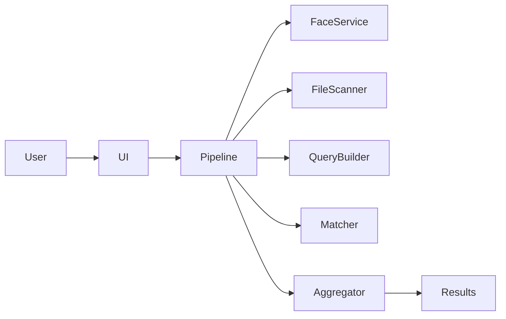
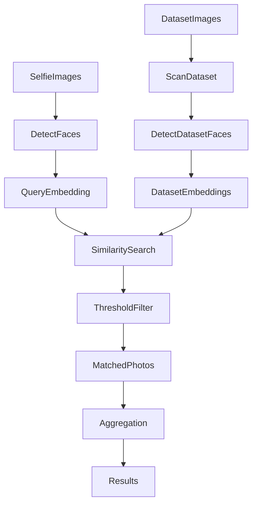

# Face Photo Search System

[繁體中文版 README](README.zh-TW.md)

AI-powered facial search tool that scans a photo collection and finds images containing a specific person using selfie input.

This project demonstrates **AI‑assisted development (Vibe Coding)** where system design, implementation, testing, and documentation were iteratively developed with AI collaboration.

---

# Demo

### Search Interface


Users upload selfie images and a dataset folder, then adjust the similarity threshold.

---

### Searching


The system scans the dataset, detects faces, and compares embeddings.

---

### Results


Matched photos are displayed with:

- bounding box
- similarity score
- ranking
- statistics

Example search result for a dataset of ~200 photos.

---

# Features

- Multiple selfie inputs
- Dataset folder upload
- Automatic face detection
- Face embedding extraction
- Cosine similarity search
- Adjustable similarity threshold
- Bounding box visualization
- Search statistics
- JSON result export
- Streamlit web UI

---

# System Architecture



Module responsibilities:

| Module | Responsibility |
|------|------|
| `app/ui.py` | Streamlit interface |
| `app/main.py` | Pipeline orchestration |
| `core/face_service.py` | Face detection + embedding extraction |
| `core/file_scanner.py` | Dataset image discovery |
| `core/query_builder.py` | Build query embeddings |
| `core/matcher.py` | Cosine similarity matching |
| `core/result_aggregator.py` | Merge duplicate matches |
| `core/reporter.py` | Export statistics and JSON output |

---

# Processing Pipeline



---

# Technology Stack

Language
- Python 3.12

Computer Vision
- InsightFace (buffalo_l model)

Libraries
- OpenCV
- NumPy
- Streamlit

Similarity Metric
- Cosine Similarity

---

# Installation

## 1. Install Python

Install **Python 3.12**.

Verify:

```
py -3.12 --version
```

---

## 2. Clone Repository

```
git clone <repository-url>
cd face-photo-search
```

---

## 3. Create Virtual Environment

```
py -3.12 -m venv .venv
```

Activate (Windows):

```
.venv\Scripts\activate
```

---

## 4. Install Dependencies

```
pip install -r requirements.txt
```

InsightFace will automatically download the required model during first execution.

---

# Running the Application

Start the web interface:

```
streamlit run app/ui.py
```

Then open the local URL shown in the terminal.

---

# Usage Guide

The system uses a **two-stage workflow**: prepare the dataset once, then search repeatedly.

## Step 1 — Upload Dataset Folder

In the sidebar, click **Browse files** under "Upload Dataset Folder" and select the folder containing photos to search.

Supported formats:

- JPG
- JPEG
- PNG

Subfolders are supported.

---

## Step 2 — Prepare Dataset

Click the **⚙️ Prepare** button.

The system will:

1. Scan uploaded images
2. Detect faces
3. Extract face embeddings
4. Build a reusable in-memory index

This only needs to be done **once per dataset**. During preparation, all other controls are disabled. Click **❌ Cancel** to interrupt and switch datasets.

---

## Step 3 — Upload Selfies

Upload one or more selfie images of the person you want to find.

Tips:

- Use clear frontal faces
- Multiple selfies improve matching reliability

---

## Step 4 — Adjust Similarity Threshold

Default value:

```
0.45
```

Lower threshold
- higher recall
- more matches

Higher threshold
- higher precision
- fewer matches

---

## Step 5 — Run Search

Click **🔍 Search**.

The system will:

1. Process selfie images
2. Compare query embeddings against the prepared dataset index
3. Filter matches by threshold
4. Display results

Search is fast and repeatable — you can adjust the threshold or change selfies and search again without re-preparing the dataset.

---

# Output

Results include:

- matched images
- bounding box highlighting the detected face
- similarity score
- search statistics

The system also exports:

```
outputs/results.json
```

Example statistics:

- total photos scanned
- photos containing faces
- matched photos
- processing time

---

# Repository Structure

```
face-photo-search
│
├─ README.md
├─ README.zh-TW.md
│
├─ docs
│  ├─ screenshots
│  │   ├─ ui_overview.png
│  │   ├─ search_running.png
│  │   └─ results.png
│  │
│  ├─ spec.md
│  ├─ vibe_log.md
│  └─ architecture_overview.md
│
├─ app
├─ core
└─ requirements.txt
```

---

# Development Documentation

Detailed design and development process are documented in:

```
docs/spec.md
docs/vibe_log.md
docs/architecture_overview.md
```

These include:

- system design
- AI collaboration workflow
- prompt engineering iterations
- implementation decisions

---

# Performance Notes

Current approach:

- Dataset embeddings are preprocessed once and cached in memory
- Repeated searches reuse the cached index without recomputation

Potential future optimizations:

- Persistent embedding cache (disk-based)
- FAISS vector index
- GPU acceleration

These improvements would allow the system to scale to thousands of images.

---

# License

This project is intended for educational and demonstration purposes.
