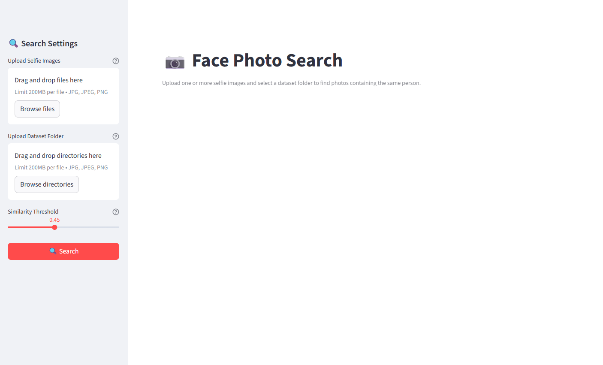
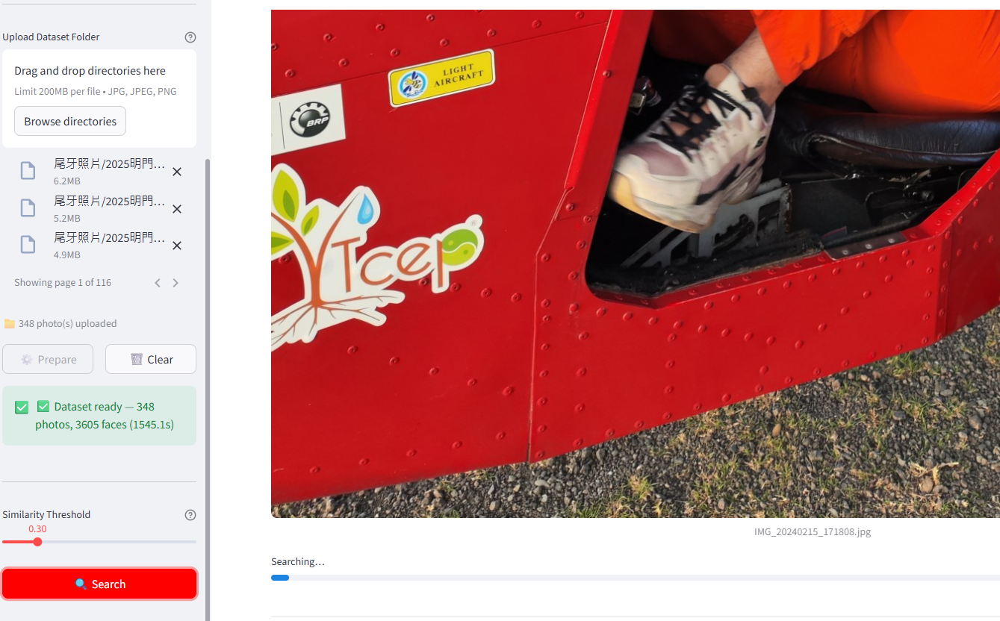
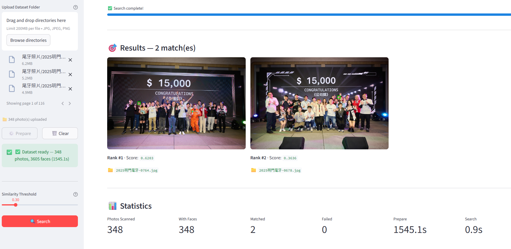
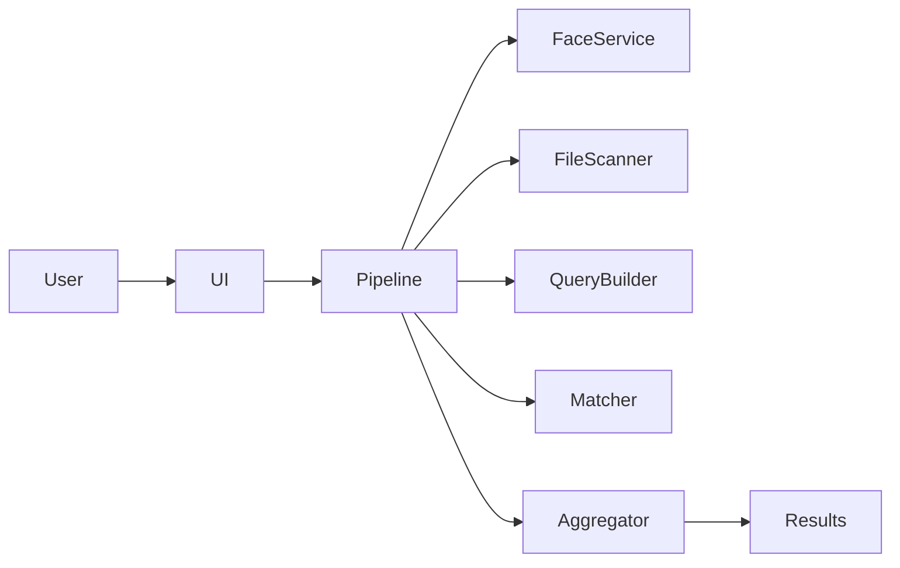
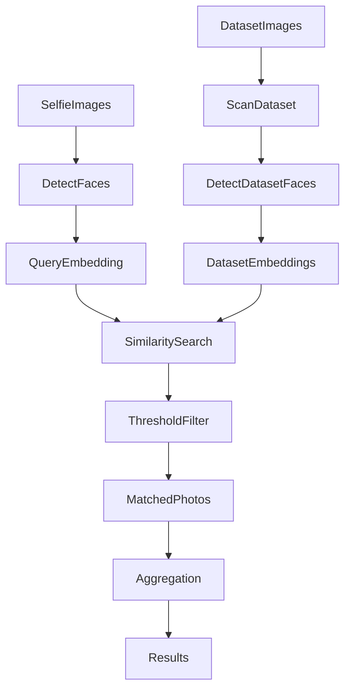

# 人臉照片搜尋系統

AI 驅動的人臉搜尋工具，掃描照片集並使用自拍照作為輸入，找出包含特定人物的圖片。

本專案展示了 **AI 輔助開發（Vibe Coding）**，系統設計、實作、測試與文件皆透過與 AI 協作的方式迭代完成。

---

# 示範

### 搜尋介面



使用者上傳自拍照和資料集資料夾，然後調整相似度門檻值。

---

### 搜尋中



系統會掃描資料集、偵測人臉，並比較特徵向量。

---

### 結果



比對成功的照片會顯示以下資訊：

- 人臉邊界框
- 相似度分數
- 排名
- 統計數據

此為搜尋約 200 張照片的範例結果。

---

# 功能特色

- 多張自拍照輸入
- 資料集資料夾上傳
- 自動人臉偵測
- 人臉特徵向量擷取
- 餘弦相似度搜尋
- 可調整相似度門檻值
- 邊界框視覺化
- 搜尋統計
- JSON 結果匯出
- Streamlit 網頁介面

---

# 系統架構



模組職責：

| 模組 | 職責 |
|------|------|
| `app/ui.py` | Streamlit 介面 |
| `app/main.py` | 管線流程編排 |
| `core/face_service.py` | 人臉偵測 + 特徵向量擷取 |
| `core/file_scanner.py` | 資料集圖片掃描 |
| `core/query_builder.py` | 建構查詢特徵向量 |
| `core/matcher.py` | 餘弦相似度比對 |
| `core/result_aggregator.py` | 合併重複比對結果 |
| `core/reporter.py` | 匯出統計數據與 JSON 輸出 |

---

# 處理流程



---

# 技術架構

程式語言
- Python 3.12

電腦視覺
- InsightFace（buffalo_l 模型）

函式庫
- OpenCV
- NumPy
- Streamlit

相似度指標
- 餘弦相似度（Cosine Similarity）

---

# 安裝

## 1. 安裝 Python

安裝 **Python 3.12**。

> ⚠️ **請勿使用 Python 3.13**——InsightFace 目前無法在 3.13 上正確安裝。

驗證：

```
py -3.12 --version
```

---

## 2. 複製儲存庫

```
git clone <repository-url>
cd face-photo-search
```

---

## 3. 建立虛擬環境

```
py -3.12 -m venv .venv
```

啟動（Windows）：

```
.venv\Scripts\activate
```

---

## 4. 安裝相依套件

```
pip install -r requirements.txt
```

InsightFace 會在首次執行時自動下載所需模型。

---

# 執行應用程式

啟動網頁介面：

```
streamlit run app/ui.py
```

然後在瀏覽器中開啟終端機顯示的本機網址。

---

# 使用指南

## 步驟 1 — 上傳自拍照

上傳一張或多張包含目標人物的自拍照。

建議：

- 使用清晰的正面照
- 多張自拍照可提高比對可靠性

---

## 步驟 2 — 上傳資料集資料夾

上傳包含待搜尋照片的資料夾。

支援格式：

- JPG
- JPEG
- PNG

支援子資料夾。

---

## 步驟 3 — 調整相似度門檻值

預設值：

```
0.45
```

降低門檻值
- 較高召回率
- 較多比對結果

提高門檻值
- 較高精確率
- 較少比對結果

---

## 步驟 4 — 執行搜尋

點擊 **Search**。

系統將會：

1. 偵測人臉
2. 擷取特徵向量
3. 比較特徵向量
4. 過濾比對結果
5. 顯示結果

---

# 輸出

結果包含：

- 比對成功的圖片
- 標示偵測到人臉的邊界框
- 相似度分數
- 搜尋統計

系統同時會匯出：

```
outputs/results.json
```

統計範例：

- 掃描照片總數
- 包含人臉的照片數
- 比對成功的照片數
- 處理時間

---

# 儲存庫結構

```
face-photo-search
│
├─ README.md
├─ README.zh-TW.md
│
├─ docs
│  ├─ screenshots
│  │   ├─ ui_overview.png
│  │   ├─ search_running.png
│  │   └─ results.png
│  │
│  ├─ spec.md
│  ├─ vibe_log.md
│  └─ architecture_overview.md
│
├─ app
├─ core
└─ requirements.txt
```

---

# 開發文件

詳細的設計與開發過程記錄於：

```
docs/spec.md
docs/vibe_log.md
docs/architecture_overview.md
```

內容包含：

- 系統設計
- AI 協作工作流程
- 提示工程迭代紀錄
- 實作決策

---

# 效能備註

目前做法：

- 每次搜尋時即時計算特徵向量

未來可能的優化：

- 特徵向量快取
- FAISS 向量索引
- GPU 加速

這些改進將使系統能夠擴展至處理數千張圖片。

---

# 授權條款

本專案僅供教育與展示用途。
